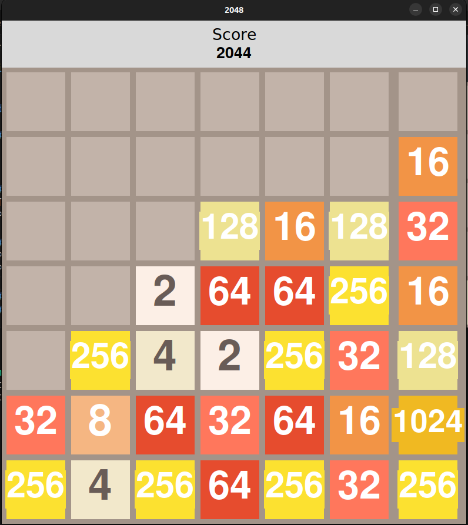

# 2048 Game
## The classic 2048 number game

<hr />
<div>
    
</div>
<hr />

### Features

 - Playing with variable grid dimensions
 - Calculating and storing the highscores
 - Current score live display

<hr />

### Technologies used

- Tkinter
- PyGame

<hr />

### Requirements

- Python v3 (pref 3.8.10)
- PyGame v2 (pref 2.1.2)

<hr />

### How to play
#### 1. Using this repo
1. Clone this repository.
```console
foo@bar:~$ git clone https://github.com/RRkundkar777/2048-Game.git
```
2. cd to the root folder and type the following
```console
foo@bar:~/2048$ python3 main.py
```

3. You can also specify the dimensions of 2048 grid by typing 
```console
foo@bar:~/2048$ python3 main.py --dim 8
```
<hr />

### Developed by
[Sanket Chaudhari](https://github.com/sanket190/) <br>
[Rushikesh Kundkar](https://github.com/RRkundkar777) <br>
[Sagar Patil](https://github.com/sagargpatil62/) <br>